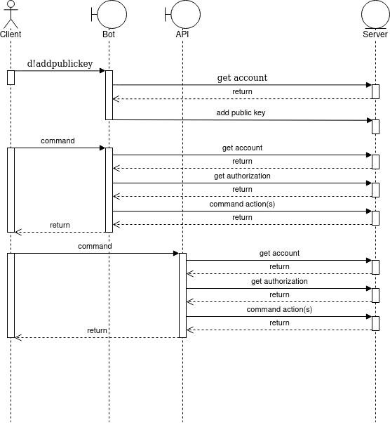
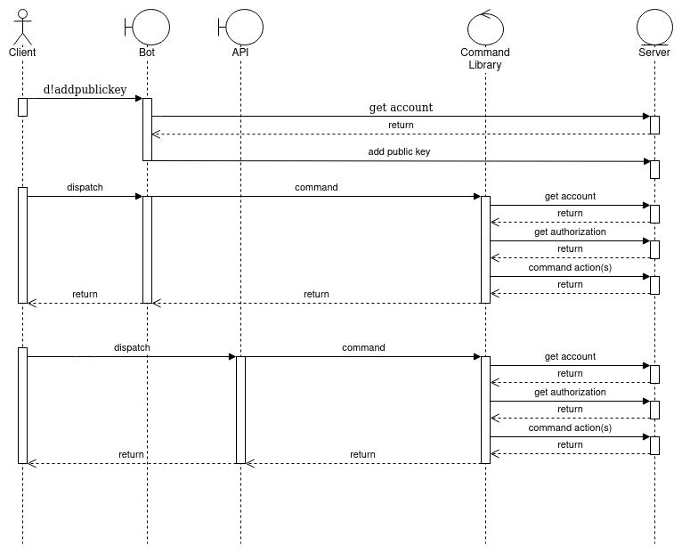

# COMMAND REFACTOR PROJECT

## REASONING

Figure 1. Current situation in which each boundary entity has to implement commands separately

Figure 2. Optimal situation in which each boundary entity calls a command routing in a command library

Currently, the `commands.py` file provides very discord-centered functionality, causing any additional API that has to be added (say HTTP) to have to reimplement those commands. The goal of this project is to create a new improved `commands.py` which is cliehnt-agnostic and works regardless of medium.

## METHODS

Easy two-step plan:

Step 1. Moving `commands.py` into `bot-ui.py`

Step 2. Moving business logic back into a new `commands.py` while keeping functions in `bot-ui.py` as like a ui wrapper around the functions

## COMMUNICATION

Communicating which message and what kind of data should be produced and returned for each boundary to convert into theri own ui messages is a problem. However, an exception-based model seems suitable for producing error messages, and the amount of data required to produce the UI message should be returned from each business logic function upon success.

### Exceptions

`CommandException()` – Base exception for other exceptions. Do not raise explicitly.  
`UnauthorizedCommandException(account_id)` – Exception to raise when a command fails because of authorization. Message is to be the account id of the caller.  
`AccountException(account_id)` – Exception to raise when an account cannot be found or already exists. Message is to be the account id of the nonexistent account.  
`ProcessException()` – Exception to raise when whatever command being executed fails. Examples include negatives where such are not accepted, or invalid PEM keys.

